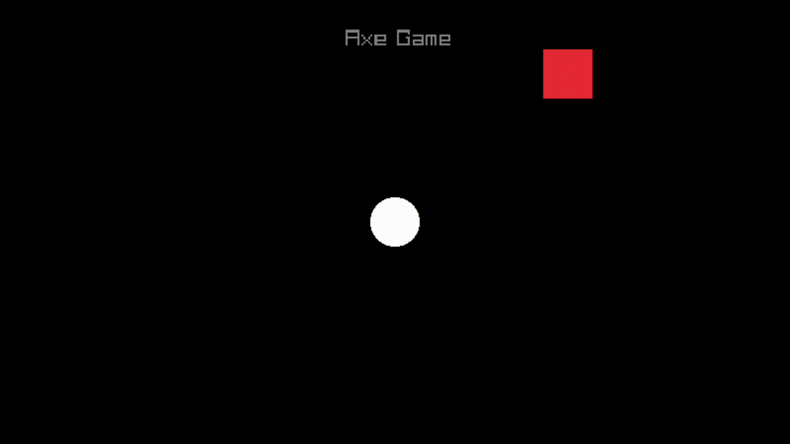

# Axe Game

## Discription
A simple 2D game where you control a white circle to avoid a moving red axe. You move left or right to dodge the axe that bounces vertically across the screen. The game ends if you get hit by the axe. It's a straightforward game focusing on timing and reflexes, playable with keyboard controls.

### Controls

| Key            | Action       |
|----------------|--------------|
| <kbd>A</kbd> or <kbd>←</kbd> | Move left    |
| <kbd>D</kbd> or <kbd>→</kbd> | Move right   |

### Preview

